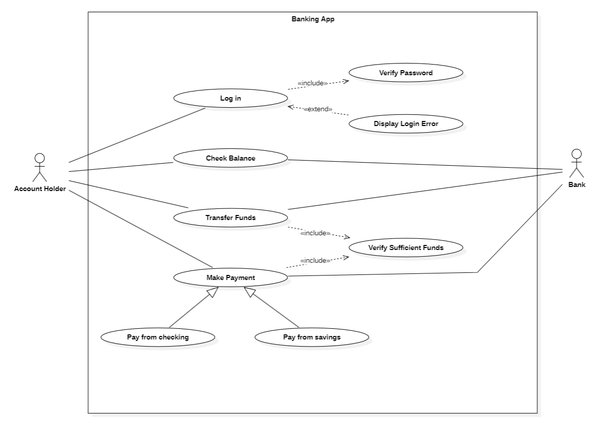
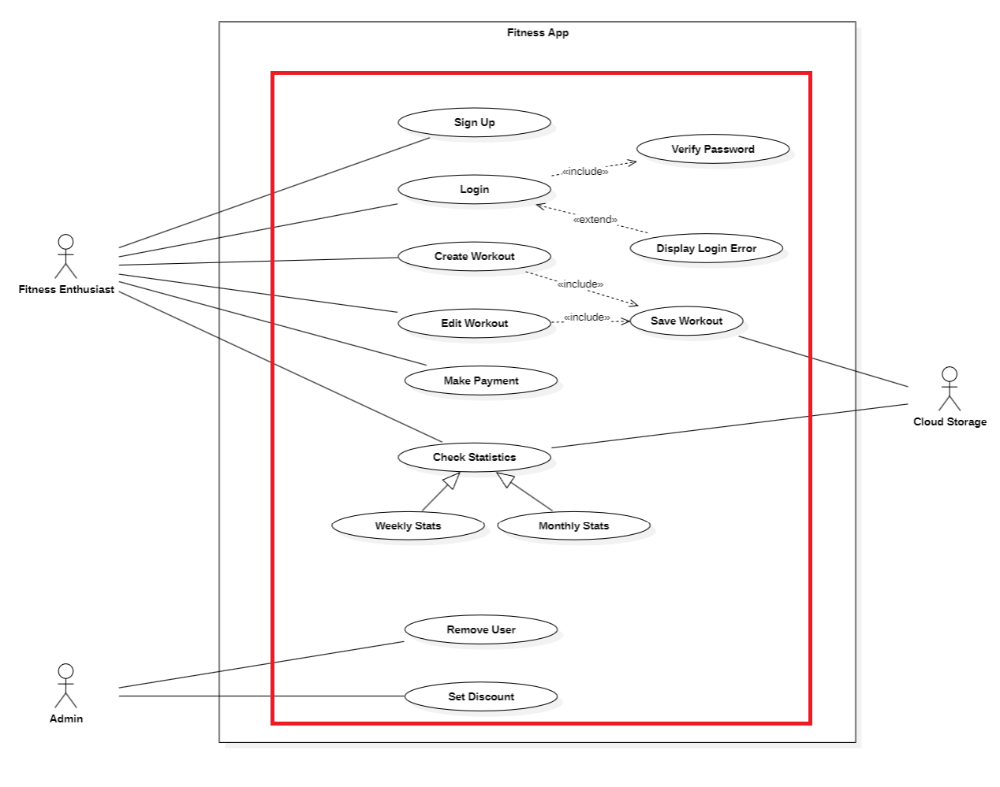

# Introduction

 It is said that a picture is worth a 1000 words. It might be worth an order of magnitude more in lines of code since use cases represent system behaviors that occur at the interface of the human user and the computer system. Thus use cases describe the "what" in contrast to other diagrams which will describe the "how." Thus the case diagram is a visual description of the overarching capabilities of a system and subsystem and an essential jumping off point for further refinement of the design.

These guidelines are meant to comprise best practices for creating unambiguous Use Case diagrams that convey an accurate and comprehensive view of user interactions that can then be decomposed further and expanded into detailed designs for system implementation.

This section will show concrete examples of what to do as well as what not to do accompanied with the justifications for the approach.

# The Guidelines
## Use Case
{ width=90% }

### Naming Use Cases
Use case names should be straightforward in describing exactly what function is required from the system. As such, use case names should be verbs or verb phrases. When using verb phrases be sure to use active voice instead of passive voice. For example "Compress Data" instead of "Perform Data Compression."

{ width=60% }

In Use Case Diagrams, use cases are written within oval shapes.

### Stacked Design for Use Cases
Use case diagrams are not intended to show the time course of system operations or specify temporal dependencies between tasks. However, if the use cases on a particular diagram do have  a logical sequence they should be displayed as an aligned stack, in the correct order, to increase readability.
## Actor

### Naming Actors
Actor names, should be unambiguous nouns.  It is OK, and actually preferable to use domain-specific terms to describe the actor as specifically as possible. Domain-relevant roles that directly map to actions described in use cases are preferred vs. general terms such as job titles. 
### Actor Placement
Actors should be placed on the outside edges of the diagram while the use cases should be placed more centrally.  Actors should not be places unless they are associated with at least one use case on the diagram. 

### Non Human Actors
An actor is not necessarily a human. It could be an electronic component, or even an entire organization depending on the level of the diagram. Most Actors are drawn as stick figures but actions that are connected with a clear temporal signal such as a calendar event or a system clock are drawn with a stick-figure representation of an hour-glass.

## Relationship

### Types of Relationships

Use Cases diagrams may express several types of relationships. Relationships can be between two use cases two actors or between an actor and a use case. Use cases come in two basic types Associations, and Generalizations.

#### Associations
Associations between actors and use cases are undirected and are indicated by a single line between the actor and the use case without arrow heads. Associations between use case display the directionality of the relationship and are indicated by a single line with a terminal arrowhead. The arrowhead is open in style and direction of the arrow indicates that one use case invokes another and the arrow head points at the use case that is being invoked by the other.

#### Generalizations
Generalizations indicate that one type of actor or use case can be considered a subtype of another. The generalization is indicated by a single line with a terminal arrowhead. The arrowhead is closed (triangular) in style and the direction of the arrowhead points at the more general of the two types (e.g. the parent class).

### Extensions vs. Inclusions
Relationship arrows may be labeled to indicate one of two categories - extensions and inclusions. Extensions and inclusions are mean to indicate high level relationships and not design decisions. Thus avoid more than two levels of these relationships as that level of design is beyond the scope of a Use Case diagram.

#### Extensions
Extensions are a type of generalization in which additional steps are performed beyond what is defined in the base case. An extension occurs after the invocation of the base case but may proceed in parallel with the actions of the base case. The extension relationship is indicated by the label `<<extend>>`

#### Inclusions
Inclusions are a type of relationship in which one use case specifically invokes another in the course of performing its actions. An inclusion can be thought of similarly to a function call where one use case implies the usage of the other's functionality. The inclusion relationship is indicated by the label `<<include>>`

### Layout & Geometry
The Use Case diagram is not an indicator of temporal sequencing. However if there is a natural ordering to the indicated activities, they should be placed top to bottom, left-to-right. The more important actors or prior use cases should appear above the others. An extending use case should be placed below the parent use case. The invoking use case should be placed to the left of the invoked use case. 

In addition to the best practices discussed here, certain publication requirements may need to be accommodated depending on the medium of publication or organizational standards. Additional additional formatting can be made compliant as follows.
#### Headers and Footers
The diagram should be able to accommodate headers and footers.  The text of the headers and footers should be centered. The color and size of the footer should be configurable to comply with external publication requirements.
#### Left & Right Margins
The left margin should be reserved for additional explanatory notes & references about each particular diagram.

The right margin should be reserved for a "Legend" or "Key" that explains the semantics of any custom fonts, font weights, or colors used in each particular diagram. 
### Other Considerations
Do not model more detail than necessary and use high level concepts in a Use Case model. Natural Language descriptions and common-sense notions are preferred. Jargon and technical language is OK only if the target audience is expected to be familiar with all the terminology used.

## System Boundary
Use cases use rectangles to indicate various system boundaries. That is, use cases that are collected to implement the functionality of a named system.
### When to (Not) Use Boundaries
System boundaries are optional and should only be used in cases where there are multiple systems or subsystems that need to be distinguished. If the use cases all belong to the same logical process, omit the system boundary as it will produced unnecessary clutter. 
### Naming Considerations
As with actors, the named system boundary should be a strong verb that indicates either the physical or logical system to which the member use cases belong.
### Lumping & Splitting
Use a boundary box only if it would increase the clarity of the diagram and set apart meaningful distinctions between the use cases as collections. Remember that a Use Case diagram is not a detailed design. Thus what is considered a "System" is at the conceptual level and only indicates groupings between the use cases as it pertains to the services that the system provides to each type of user.  Avoid making distinctions with no functional visibility to the user and collect related actions based on their overall effects to the resulting outputs.

# Conclusion

Just because the Use Case diagram describes high-level concepts it does not absolve them from being constructed in a rigorous fashion. On the contrary, design at this level must be managed with increased caution since misunderstandings conveyed from these diagrams to further elaborations of detailed design will be multiplied resulting in errors that will be both insidious and expensive to fix.

# References
\[1] The Elements of UML Style
\[2] How consistency is handled in model‑driven software engineering and UML: an expert opinion survey Software Quality Journal (2023) 31:1–54 https://doi.org/10.1007/s11219-022-09585-2
\[3] OMG Systems Modeling Language (OMG SysML™) Tutorial (September, 2009)
\[4] SYSML V2: Where We Are and How We Got Here (OMG Meeting Orlando, FL June 21, 2023)